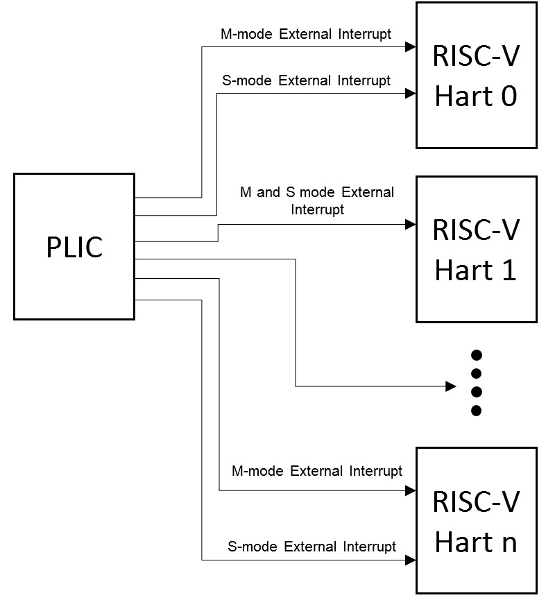
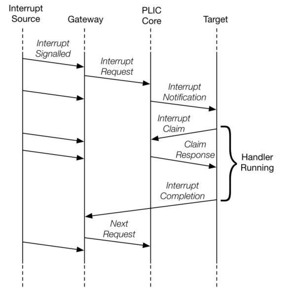

# lab02: traps and basic device drivers

## Table of contents

1. [Overview](#overview)
2. [Objectives](#objectives)
3. [Lab requirements](#lab-requirements)
4. [Implementing traps](#implementing-traps)
5. [Implementing timer interrupts](#implementing-timer-interrupts)
    1. [Configuring the interrupt](#configuring-the-interrupt)
    2. [Enabling the interrupt](#enabling-the-interrupt)
6. [Implementing a basic serial device driver](#implementing-a-basic-serial-device-driver)
    1. [Interacting with the emulated serial device](#interacting-with-the-emulated-serial-device)
    2. [Using the Platform Level Interrupt Controller (PLIC)](#using-the-platform-level-interrupt-controller-plic)
    3. [Concurrency, locking and interrupts](#concurrency-locking-and-interrupts)
7. [Appendix A: virtual memory layout for the kernel
](#appendix-a-virtual-memory-layout-for-the-kernel)
8. [Appendix B: helpful files for this lab](#appendix-b-helpful-files-for-this-lab)
9. [Appendix C: tips and common issues](#appendix-c-tips-and-common-issues)

## Overview

After studying about traps, exceptions and interrupts in class, it is now time
to put what we learned to practice. This lab will be different from lab01:
instead of receiving a detailed suite of unit tests that define exactly what
functions you have to implement and how, you will be given a more open-ended
assignment: **implement a basic shell** for the kernel by leveraging RISC-V's
interrupt handling architecture. We will provide a basic skeleton to help you
get started, but you are free to modify it as you wish.

Due to the inherently tricky nature of interrupts, we haven't quite figured out
a way to unit-test these functionalities without some horrible hacks (we're
open to suggestions if you have any ideas). As such, we will only test the
final product of this lab, i.e., the shell implementation. The grader tests
will not touch the kernel code at all this time, and your solution will be
evaluated solely based on the correctness of the shell functionality.

### IMPORTANT: guidelines for student responsibility when submitting solutions

When grading the lab01 submissions, there were multiple cases of student
solutions that tampered with the unit tests. These modifications range from
relatively innocent (e.g. changing the entire kernel source tree because of a
newline incompatibility due to the fact that Windows is a fundamentally
unserious operating system) to more serious (e.g. changing the test cases to
get the tests to pass). From this assignment onwards we're establishing a clear
policy:

1) **Touching any test files in your submission will automatically zero your
lab grade**. We will implement this check in the grader script itself so that
nobody gets an unpleasant surprise when the lab grades spreadsheet is released.
You are welcome to fix the issue and resubmit your solution within the
deadline, but if your grade in the final result spreadsheet is zeroed because
of this issue, **there will be no amendments**.

2) **You are entirely responsible for the contents of your submission**. This
is especially important for those of you that are using LLMs irresponsibly to
one-shot the assignments without understanding the code that was generated: if
your submission does not meet the lab requirements (e.g. doesn't implement the
serial driver for your shell console using an asynchronous/interrupt-based
approach) or is otherwise considered dishonest in nature, **you** will be held
responsible; "the LLM wrote this and I didn't notice" is **not** an excuse.

## Objectives

In this lab you will:

1) Implement support for traps (exceptions + interrupts) in the kernel
following the RISC-V spec

2) Implement support for timer interrupts in the kernel

3) Implement support for external interrupts (i.e. originating from external
devices) using the Platform-Level Interrupt Controller (PLIC)

4) Write a basic device driver for an 8250/16550 serial port, capable of
receiving input asynchronously (using interrupts)

5) Use spinlocks to protect access to critical data sections that might
be shared between interrupt context and your main application code

6) Implement a simple shell leveraging all of the above

## Lab requirements

You should implement a small shell that supports running a small number of
commands. It should display a `>` trailing character and execute commands upon
receiving a `Carriage Return` character (`'\r'`, hex code `0x0d`, a.k.a. what
is sent when you press Enter). The shell should also echo the user input (e.g.
send back every character it receives) so that the user can see what they're
typing.

Below is an illustrative example of what using the shell should look like:

```text
> uptime
1281s
> echo test
test
> alarm 10
alarm
```

Below is a list of commands your shell should support:

| Command   | Description |
| -------   | ----------- |
| `uptime`        | Display the time since the kernel booted, in seconds |
| `echo [str]`    | Print a user-provided string to the terminal |
| `alarm [time]`  | Print the string `alarm` in `[time]` seconds from now. |

It is a **hard requirement** that you use serial interrupts (at least for
receiving data) and timer interrupts to implement your solution.

You have complete freedom to implement your solution and to modify the source
tree however you wish, except of course for the grading tests. The following
files:

- [`include/kernel/trap.h`](../include/kernel/trap.h), [`src/trap.c`](../src/trap.c), [`src/trap_entry.S`](../src/trap_entry.S)
- [`include/arch/timer.h`](../include/arch/timer.h), [`src/timer.c`](../src/timer.c)
- [`include/kernel/serial.h`](../include/kernel/serial.h), [`src/drivers/serial.c`](../src/drivers/serial.c)
- [`src/kmain.c`](../src/kmain.c)

contain a skeleton that should help you get started, but you are free to
change everything.

Please do use common sense and try, e.g., not to submit a solution that changes
formatting for all files in the source tree since the diff will be huge and all
submissions will be reviewed manually.

## Implementing traps

As we learned in class, a *trap* is a special event that requires immediate
attention from the CPU; this event will cause the CPU to halt its execution and
jump to a function (which we call the *trap handler*) that is responsible for
handling the event.

There are two important classes of events:

- **Synchronous** traps (called **exceptions**) occur upon the execution of an
  instruction. For example, running a privileged instruction in user mode will
  raise an Illegal Instruction exception, whereas trying to access an invalid
  virtual memory address raises a Page Fault exception.
- **Asynchronous** traps (called **interrupts**) can occur at any point in time
  and are usually associated with a hardware event coming from an **external
  device**, such as a key being pressed on a keyboard or a packet arriving
  in a network card.

In riscv64, there are 3 important 64-bit CSRs that play a role in trap handling:

- [`stvec`](https://docs.riscv.org/reference/isa/priv/supervisor.html#12-1-1-2-supervisor-trap-vector-base-address-stvec-register)
  contains the (virtual) address of the trap handler, e.g., the function that
  the CPU will jump to when an exception happens. **Important**: this address
  must be 4-byte aligned

- [`scause`](https://docs.riscv.org/reference/isa/priv/supervisor.html#scause)
  contains the exception code identifying the trap. Note that bit 63 defines
  whether the trap was an exception or an external interrupt. You can find the
  full list in the the [documentation](https://docs.riscv.org/reference/isa/priv/supervisor.html#scause)


- [`stval`](https://docs.riscv.org/reference/isa/priv/supervisor.html#12-1-1-9-supervisor-trap-value-stval-register)
  contains exception-specific information; more importantly, in the event of
  an access/page fault, this CSR will contain the **address of the instruction**
  where the exception happened. This is useful for debugging page faults in
  your own code (hint: there is a trap handler in `src/ktest/kmain.c` from
  lab01 that keeps track of page faults)

Another important point is that, like we covered in class, since the CPU jumps
immediately to the address in `stvec` upon a trap, we need to make sure to
**save all registers** (generally to the stack) before entering the actual trap
handler function, and restore them after returning from it. This is usually
done with a small assembly stub; you will find a skeleton for that in
[src/trap_entry.S](../src/trap_entry.S).

### Suggested tasks for this part

- Fill out the assembly stub in [src/trap_entry.S](../src/trap_entry.S) by
  saving all registers onto the stack, then jumping to the trap handler, and
  finally loading the saved values on the stack back to the registers
- Implement the actual trap handler by reading the exception code in `scause`
  (and possibly the value in `stval` in case of an access/page fault)
- Consider looking at bit 63 in `scause` in order to assert immediately whether
  you're dealing with an exception or an interrupt (ideally you would like to
  forward work to separate functions depending on whether it's an exception,
  timer interrupt or serial interrupt)
- Also consider using this opportunity to pretty-print information about page
  faults (will make your life much easier when debugging)

## Implementing timer interrupts 

### Configuring the interrupt

Every RISC-V core should have access to a monotonic time counter (e.g. a
counter that starts at 0 when the hart boots and increases periodically
following a clock signal) that can be read through an unprivileged CSR called
`time`. We have also made preparations to allow you to use an S-mode CSR called
`stimecmp`, which is responsible for configuring the **timer interrupt** for
the kernel: whenever `time == stimecmp`, a timer interrupt signal is generated.

The clock signal that increases the counter in the `time` CSR runs at
**10MHz**. This means that setting up a timer interrupt for, say, 2 seconds
from now, looks like the following:

```c
    #define TIMER_FREQ 10000000
    u64 now = csr_read(CSR_TIME);
    u64 tick_in_1s = now + 2*TIMER_FREQ;
    csr_write(CSR_STIMECMP, tick_in_1s);
```

### Enabling the interrupt

Before the timer interrupt signal is actually delivered to the hart, we need to
configure two CSRs:

- The `sstatus[SIE] = sstatus[1]` bit enables or disables interrupts for the
  hart: if this bit isn't set to 1, the hart will not trap upon receiving an
  interrupt signal ([docs](https://docs.riscv.org/reference/isa/priv/supervisor.html#sstatus))


- The `sie` (Supervisor Interrupt Enable) CSR controls which interrupt
  sources are enabled; we are interested in two sources: `sie[STIE]`
  (Supervisor Timer Interrupt Enabled) and `sie[SEIE]` (Supervisor
  External Interrupt Enabled). `STIE` gates the timer interrupt,
  and we want to set it to 1; `SEIE` gates the external interrupts
  (usually from devices, such as the UART serial we use for printing
  messages); we will enable it when setting up the serial device driver.
  ([docs](https://docs.riscv.org/reference/isa/priv/supervisor.html#12-1-1-3-supervisor-interrupt-sip-and-sie-registers))


### Suggested tasks for this part

- Implement a function that allows to set up a timer interrupt for a given amount of time in the future
- Make sure to enable the correct bits in `sstatus` and `sie`

## 3. Implement a basic serial device driver

### Interacting with the emulated serial device

QEMU, the emulator that is running the virtual machines that we test the kernel
on, is able to emulate various pieces of hardware. One of them is a **serial
port**, which in real life is a hardware device that enables sending data
bidirectionally from one place to another (e.g. from an embedded device, such
as an ESP32 board or an FPGA, to your laptop, and vice-versa). If you inspect
the virtual machine device tree with the following commands:

```bash
$ qemu-system-riscv64 -machine virt -machine dumpdtb=vm.dtb
$ dtc -qI dtb vm.dtb
```

you will be able to find the following node:

```dts
 serial@10000000 {
         interrupts = <0x0a>;
         interrupt-parent = <0x03>;
         clock-frequency = "", "8@";
         reg = <0x00 0x10000000 0x00 0x100>;
         compatible = "ns16550a";
 };
```

This node represents the emulated serial port that QEMU has prepared for our
virtual machine. There are a couple of key pieces of information here:

- `compatible = "ns16550a"` tells us that this is an emulated National
  Semiconductor 16550 device. You can find a datasheet for that device
  [here](https://courses.grainger.illinois.edu/ece391/su2025/docs/NS16550A.pdf).
- `serial@10000000` tells us that this device is **memory-mapped** to the base
  physical address `0x10000000`. This means that the device registers can be
  accessed as though they were regular memory -- for example, reading/writing
  to the 8-bit `Line Control Register` (register address `0x3`, according to
  the datasheet) means reading/writing to thephysical  memory address
  `0x10000000 + 0x3 = 0x10000003`. 
- Each external (i.e. hardware) interrupt signal is identified by an number
  (often called an IRQ number); `interrupts = <0x0a>` tells us that this device
  has a single interrupt line, with the IRQ number `0x0a`.

You will need to configure the device registers appropriately to get
the serial port to behave the way you want. All the information you need
is in the datasheet; in particular, you might want to look into:

- Receiving/sending bytes to the serial port by reading/writing from the
  `Receiver Buffer Register` at `0x10000000`
- Enabling the appropriate interrupts in the `Interrupt Enable Register (IER)`
- Enabling FIFOs in the `Fifo Control Register (FCR)`
    - The FIFOs are internal hardware buffers in the NS16550 that store
      multiple bytes of data in first-in, first-out fashion. When you're
      reading data from the serial with FIFOs enabled, instead of reading one
      byte and then triggering an interrupt, the NS16550 can store up to 8
      bytes in one go, so that when you get interrupted you can read a few
      characters from the serial at a time.

### Using the Platform Level Interrupt Controller (PLIC)

You will notice that even after enabling serial interrupts in the `Interrupt
Enable Register` and enabling external interrupts in the `sie` CSR, your
interrupt handler still doesn't get called. This is because we need to
configure one last piece of hardware before getting hardware interrupts:
the **Platform Level Interrupt Controller (PLIC)**.



The PLIC is responsible for routing external (i.e. hardware) interrupts to the
harts in a system. It allows us to:

- **Enable/disable** specific interrupts (identified by their IRQ numbers) for
  a hart
- Assign each interrupt a **priority**, so that higher priority interrupts get
  serviced before lower priority ones
- Define a hart-local **threshold** so that a hart can ignore interrupts with
  a priority lower than the threshold

We have provided you with a PLIC driver in [include/arch/plic.h](../include/arch/plic.h)
and [src/drivers/plic.c](../src/drivers/plic.c) so that you don't have to spend
too much time figuring out the memory-mapped register layout for the interrupt
controller (it is kind of cursed).

Upon configuring and enabling the serial interrupt, your trap handler will
get called with bit 63 in `scause` set to 1 (refer to the
[RISC-V docs](https://docs.riscv.org/reference/isa/priv/supervisor.html#scause) again).
If the value (minus the top bit) is `9`, this means an external interrupt
happened. In order to actually service the interrupt, the hart has to perform a
handshake of sorts with the PLIC:

- First the hart will *claim* the interrupt. This is encapsulated by the
  `plic_hart_claim_irq()` helper (note that the kernel is currently always
  running in hart 0 since we have not implemented SMP support at this point)
- Claiming the IRQ number gives us the IRQ number of the interrupt that
  occurred. Note that getting a `0` means that the current hart failed to claim
  the IRQ because another hart got to it first (can't happen in our current
  situation since we only have one hart)
- The hart then calls the appropriate IRQ handler for the interrupt (in
  this case, the `serial_irq()` handler)
- When the interrupt handler finishes, the hart needs to notify the PLIC
  that it finished handling the interrupt; this is wrapped by the
  `plic_hart_complete_irq()` helper.
 


### Concurrency, locking and interrupts

What about concurrency issues? For example, suppose you have the following
struct in the serial driver:

```c
struct serialdev {
    /* buffer storing received serial data */
    char buf[SERIAL_BUF_SIZE]; 
    /* number of bytes stored in this buffer */
    size_t len;
    ...
} dev;
```

And then in the `serial_irq()` handler, you would maybe store the
data like this:

```c
void serial_irq()
{
    ...

    if (dev.len >= SERIAL_BUF_LEN) {
        /* buffer is full */
        return;
    }

    dev.buf[dev.len++] = serial_read_byte();

    ...
}
```

Your application will periodically want to flush this buffer to read
the data (since if it fills up you will end up dropping bytes):

```c
/* Copy out all data and reset the buffer */
void serial_flush(char *buf)
{
    size_t size = dev.len;
    for (size_t i = 0; i < size; i++) {
        buf[i] = dev.buf[i];
    }
    dev.len = 0;
}
```

Now, interrupts are asynchronous events, which means that at any point
in time the CPU might stop executing code and jumping to the interrupt
handler. Imagine the following unfortunate sequence of events:

- CPU is inside the for loop in `serial_flush()`
- Serial interrupt happens, CPU jumps to trap handler and `serial_irq()` is
  called
    - `serial_irq()` does `dev.len++`
- CPU goes back to executing `serial_flush()`
    - The `size` variable in `serial_flush()` still has the old `dev.len`
      value!
    - We will reset `dev.len = 0` and miss the newly arrived bytes

This is an example of a race condition. We need to protect accesses
to the critical section (in this case, `dev.buf` and `dev.len`) using
a lock.

We have provided you with an implementation of a simple **spinlock**
in [`include/arch/spinlock.h`](../include/arch/spinlock.h). The
usage and implementation details are documented in the header, but
it essentially tries to grab the lock in a loop (e.g. it *spins*
until it grabs the *lock*, hence the name):

```c
void spin_lock(struct spinlock *s)
{
    while (!spin_trylock(s)) { }
}
```

> [!NOTE]
> Since grabbing the lock is a **blocking** operation (e.g. you loop
until it becomes available, also called busy-waiting), in an SMP system with
multiples CPUs trying to take the lock, you as the programmer have to ensure
that this lock is released in a finite amount of time (otherwise everybody else
will spin forever). This won't be a concern for this lab but is a very common
issue in real world kernels.

## Appendix A: virtual memory layout for the kernel

A few things have changed in the kernel source code since last class. As
discussed in class, the kernel now runs in the higher half of the virtual
address space (this makes things easier when implementing user space later).
The current virtual memory layout is quite simple:

```
 0x0000_0000_0000_0000 ┌─────────────────────────────────────────────┐
                       │                                             │
                       │      Unmapped / Reserved for userspace      │
                       │               (Lower Half)                  │
                       │                  256 GiB                    │
                       │                                             │
 0x0000_003F_FFFF_FFFF └─────────────────────────────────────────────┘
                       ┌─────────────────────────────────────────────┐
                       │░░░░░░░░░░░░░░░░░░░░░░░░░░░░░░░░░░░░░░░░░░░░░│
                       │░░░░░░░░░░░░░░░░░░░░░░░░░░░░░░░░░░░░░░░░░░░░░│
                       │░░░░░░░░░ Non-Canonical Hole ░░░░░░░░░░░░░░░░│
                       │░░░░░░░░░░ (not addressable) ░░░░░░░░░░░░░░░░│
                       │░░░░░░░░░░░░░░░░░░░░░░░░░░░░░░░░░░░░░░░░░░░░░│
                       │░░░░░░░░░░░░░░░░░░░░░░░░░░░░░░░░░░░░░░░░░░░░░│
 0xFFFF_FFBF_FFFF_FFFF └─────────────────────────────────────────────┘
                        ─ ─ ─ KERNEL_VA_START ─ ─ ─ ─ ─ ─ ─ ─ ─ ─ ─
 0xFFFF_FFC0_0000_0000 ┌─────────────────────────────────────────────┐  ◄── KERNEL_DIRECT_MAP_START
                       │                                             │
                       │         Direct Mapping Region               │
                       │              32 GiB, RWX                    │
                       │                                             │
                       │   VA = KERNEL_DIRECT_MAP_START + PA         │
                       │   PA = VA - KERNEL_DIRECT_MAP_START         │
                       │                                             │
 0xFFFF_FFC8_0000_0000 ├─────────────────────────────────────────────┤
                       │                                             │
                       │                                             │
                       │         Unmapped / Reserved                 │
                       │               222 GiB                       │
                       │                                             │
                       │                                             │
 0xFFFF_FFCF_8000_0000 ├─────────────────────────────────────────────┤
                       │                                             │
                       │                                             │
                       │            Kernel code                      │
                       │               2 GiB                         │
                       │                                             │
                       │                                             │
 0xFFFF_FFFF_FFFF_FFFF └─────────────────────────────────────────────┘  ◄── KERNEL_VA_END
```

The kernel code is mapped to the last 2GiB of virtual memory. We also set up a
**direct map** region of size 32GiB that maps to the first 32GiB of physical
memory; this allows us to easily access physical memory by through the virtual
address `VA = KERNEL_DIRECT_MAP_START + PA`.

## Appendix B: helpful files for this lab
- [`include/kernel/printf.h`](../include/kernel/printf.h): `printk`-related
  functions for logging (`info`, `warn`, `error`, etc)
- [`include/arch/csr.h`](../include/arch/csr.h): helpers for accessing CSRs
- [`include/arch/spinlock.h`](../include/arch/csr.h): a spinlock implementation
- [`include/arch/plic.h`](../include/arch/spinlock.h): helpers for
  configuring the PLIC
- [`include/kernel/string.h`](../include/kernel/string.h): string manipulation
  functions

## Appendix C: tips and common issues

- When debugging why interrupts are not firing:
    - Ensure that `SIE` bit in `sstatus` is set, as well as the appropriate bits in `sie` 
    - For external interrupts, also ensure that you configured the PLIC
      properly and i) set a priority for the IRQ, ii) set the interrupt
      threshold and iii) enabled the interrupt
    - For the serial interrupt, make sure that you're running the kernel with
      the `./qemu.sh` script (as detailed in [README.md](../README.md)); if you
      run it with `meson compile ...` your keystrokes will not be redirected to
      the virtual machine
- When debugging page faults:
    - If you're accessing registers, ensure that you're using appropriate
      virtual addresses (from the direct map area) instead of raw physical
      addresses
    - If you capture the address of the faulting instruction in `sepc`, you can
      run `llvm-objdump -Sd build/src/kernel.elf` to disassemble your
      executable and search for the faulting address to find the exact
      instruction where your code is crashing
- You can pass the `--gdb` flag to `qemu.sh` to make QEMU start a GDB server;
  this will halt your virtual machine until you a GDB instance connects to it,
  which you can use to step through your code, set breakpoints and whatnot. To
  do this, run `./qemu.sh build/src/kernel.elf` in one terminal window, and
  then `gdb -tui` (or `gdb-multiarch -tui` on Debian/Ubuntu) in another
  terminal window.
